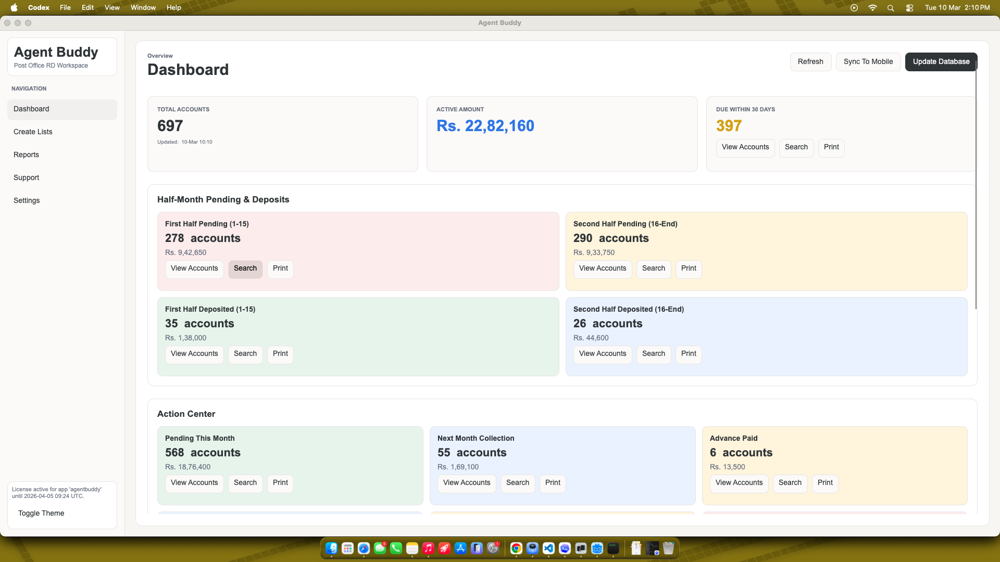
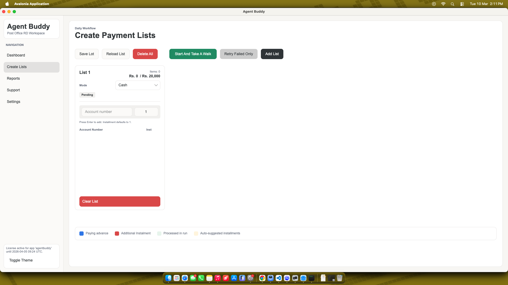
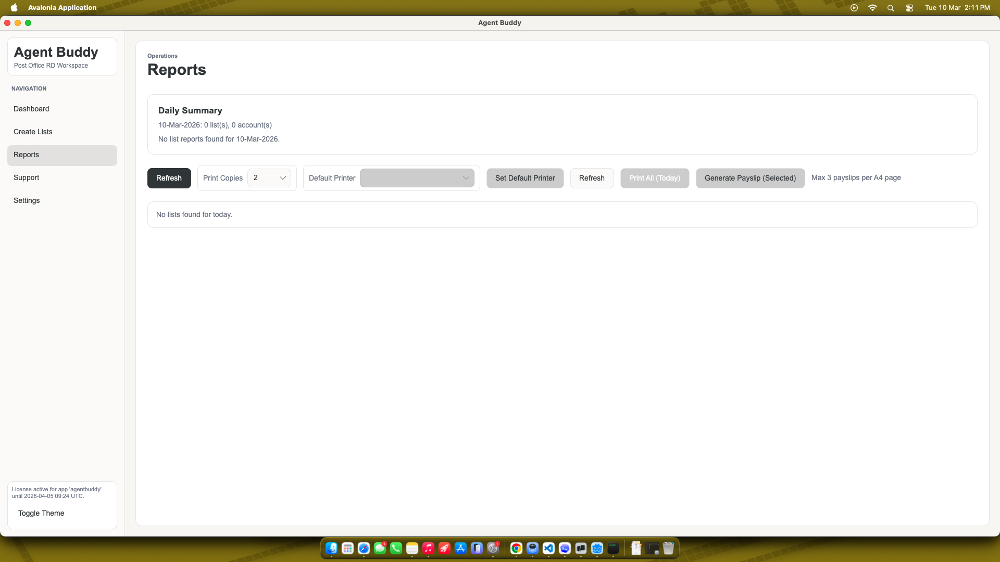
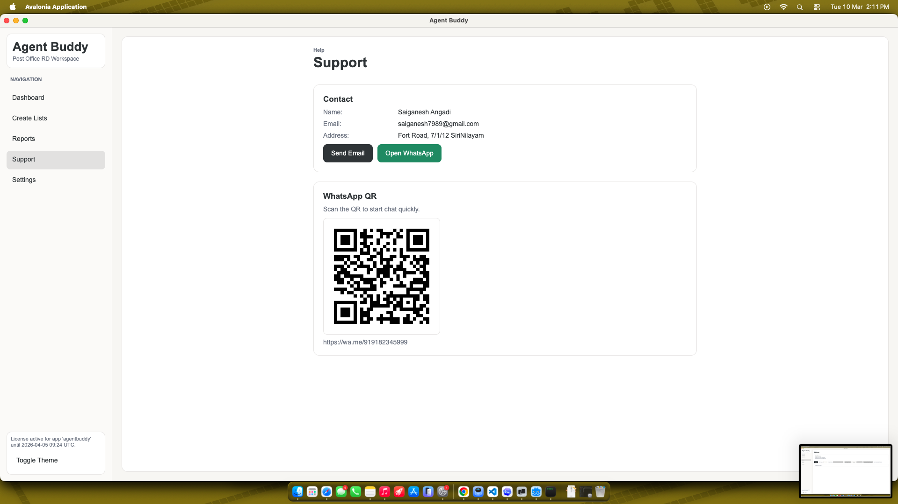

# Agent Buddy

Agent Buddy is a cross-platform Avalonia desktop app that helps India Post DOP agents manage RD (Recurring Deposit) accounts, create payment lists, generate reports, and sync data to a mobile dashboard. It uses a local SQLite database and integrates with Python automation scripts for portal updates and list processing.

## Key Features
- Dashboard with account totals, due-soon tracking, and monthly collection trends.
- Create and process payment lists with validation, installments, and payment modes (Cash, DOP Cheque, Non DOP Cheque).
- Report management with PDF viewing, printing, and payslip generation.
- Mobile sync to a dashboard API (default: [rd-base](https://rd-base.vercel.app)).
- Localization support for English, Hindi, and Telugu.
- Built-in licensing flow using JWT tokens (optional online validation).

## Screenshots
The current UI screenshots live in `docs/screenshots/`:

Dashboard overview.


Create Lists workspace.


Reports view.


Support view.


## Tech Stack
- .NET `net10.0` (Avalonia UI 11.3.x)
- SQLite via `Microsoft.Data.Sqlite`
- LiveCharts for dashboard charts
- ReactiveUI for MVVM

## Architecture Overview
- `Program.cs` and `App.axaml` set up Avalonia and styles.
- `ViewModels/` contains MVVM state and app workflows.
- `Views/` contains Avalonia UI layouts and code-behind.
- `Services/` provides database access, reports, Python integration, licensing, and mobile sync.
- `Models/` defines RD account and reporting data structures.
- `Resources/` contains localized string resources.
- `Styles/` contains theme tokens, control styles, and animations.

## Data and File Locations
Agent Buddy stores all working data under the DOPAgent base directory:
- Base directory: `~/Documents/DOPAgent` (falls back to app base directory if Documents is unavailable).
- SQLite DB: `~/Documents/DOPAgent/dop_agent.db`
- Reports: `~/Documents/DOPAgent/Reports/`
  - Reference log: `Reports/references/payment_references.txt`
  - PDFs: `Reports/pdf/`
- State snapshots: `~/Documents/DOPAgent/State/`

## Python Automation Requirements
The app expects these Python scripts in the base directory:
- `Fetch_RDAccounts.py`
- `ScheduleArguments.py`
- `Sync_Legacy_AccountDetail.py`
- `Generate_Payslips.py`

Python packages required:
- `selenium`
- `pandas`
- `pyperclip`
- `openpyxl`
- `xlrd`
- `reportlab`
- `PIL`

The app can install missing packages via `pip` when you run updates.

## Build and Run
From the repo root:
```bash
# build
dotnet build /Users/gani/Downloads/AgentBuddy/AgentBuddy.csproj

# run
dotnet run --project /Users/gani/Downloads/AgentBuddy/AgentBuddy.csproj
```

## App Workflows
- **Dashboard**: Metrics, due-soon lists, and quick print/search for segments.
- **Create Lists**: Add accounts, set installments, and process lists via Python automation.
- **Reports**: View/print daily reports and generate payslips.
- **Settings**:
  - Manage portal credentials and mobile sync API settings.
  - Configure default printer and automation browser.
  - Sync legacy SQLite data into the current database.
  - Update missing ASLAAS numbers.
  - Activate or validate application licenses.

## Licensing
The app is gated by a JWT license token. When no valid license is detected, navigation is limited to Settings where you can activate or validate a license. Online validation is optional if a license server URL is provided.

## Notes
- On Windows, PDF printing uses SumatraPDF or Adobe Reader if installed; otherwise manual printing is required.
- On macOS/Linux, printing uses `lp` and printer discovery uses `lpstat`.
- The UI enforces a maximized window on launch.

## Unsigned Builds
Releases are shipped unsigned to keep the app free and easy to distribute. First‑time launch will show a security warning.
See `docs/UNSIGNED_INSTALL.md` for the one‑time steps to open the app on Windows and macOS.
For maintainers, release steps are documented in `docs/RELEASE_CHECKLIST.md`.

## Repository Map
- `AgentBuddy.csproj`: Project file and package references.
- `App.axaml`: Global styles and converters.
- `Services/DatabaseService.cs`: SQLite schema, settings, credentials, and data access.
- `Services/PythonService.cs`: Python automation integration.
- `Services/ReportsService.cs`: PDF and printer handling.
- `ViewModels/`: Application logic and workflows.
- `Views/`: Avalonia UI layouts.
